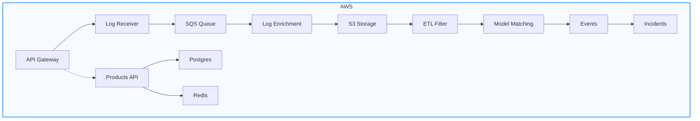
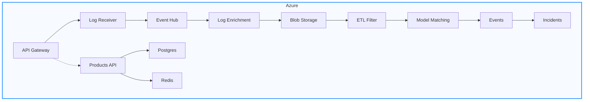

# Log2Incident

A log processing and product operations platform with a FastAPI backend, React frontend, Redis cache, and Postgres persistence.

## Overview

The platform has two tracks:

1. Log pipeline: receives logs, sends them through SQS, tags and stores them, then creates events/incidents.
2. Product control flow: uses Postgres as source-of-truth with Redis read/write-through caching for product data.

## Architecture

### AWS Architecture
#### Visual Flowchart



```
  +-------------------+      +-------------------+      +-------------------+
  |   API Gateway     | ---> |   Log Receiver    | ---> |     SQS Queue     |
  +-------------------+      +-------------------+      +-------------------+
                               |
                               v
  +-------------------+      +-------------------+      +-------------------+
  | Log Enrichment    | ---> |   S3 Storage      | ---> |   ETL Filter      |
  +-------------------+      +-------------------+      +-------------------+
                               |
                               v
  +-------------------+      +-------------------+      +-------------------+
  |  Model Matching   | ---> |     Events        | ---> |   Incidents       |
  +-------------------+      +-------------------+      +-------------------+

  +-------------------+      +-------------------+      +-------------------+
  |  Products API     | ---> |    Postgres       |      |      Redis        |
  +-------------------+      +-------------------+      +-------------------+
```

### Azure Architecture
#### Visual Flowchart



```
  +-------------------+      +-------------------+      +-------------------+
  |   API Gateway     | ---> |   Log Receiver    | ---> |    Event Hub      |
  +-------------------+      +-------------------+      +-------------------+
                               |
                               v
  +-------------------+      +-------------------+      +-------------------+
  | Log Enrichment    | ---> |  Blob Storage     | ---> |   ETL Filter      |
  +-------------------+      +-------------------+      +-------------------+
                               |
                               v
  +-------------------+      +-------------------+      +-------------------+
  |  Model Matching   | ---> |     Events        | ---> |   Incidents       |
  +-------------------+      +-------------------+      +-------------------+

  +-------------------+      +-------------------+      +-------------------+
  |  Products API     | ---> |    Postgres       |      |      Redis        |
  +-------------------+      +-------------------+      +-------------------+
```

**Notes:**
- **Log Receiver**: Enriches logs (adds metadata, normalization, basic tagging).
- **ETL Filter**: Service deployed in EKS/AKS, applies filter logic to logs.
- **Model Matching**: The core logic that uses rules/models to match/enrich logs, create events, and aggregate incidents.

The system consists of two main components:

### 1. API Gateway & Log Receiver
- **API Gateway**: FastAPI-based HTTP endpoint that receives logs via REST API
- **Log Receiver**: Accepts logs and queues them to AWS SQS for processing
- **Auth**: Username validation + login with immediate username errors and accumulated wrong-password attempts
- **Products**: Product list/get/update APIs backed by Postgres + Redis
- Provides endpoints:
  - `POST /logs` - Submit a log entry
  - `GET /health` - Health check
  - `GET /auth/validate-username` - Check username exists
  - `POST /auth/login` - Login endpoint
  - `GET /products` - List products
  - `GET /products/{product_id}` - Fetch one product
  - `PATCH /products/{product_id}/price` - Update product price (syncs Redis immediately)

### 2. Processing Pipeline
1. **Ingestion**: Consume logs from AWS SQS queue
2. **Tagging**: Apply model-matching to add tags to logs
3. **Storage**: Store tagged logs in S3 bucket
4. **ETL Filter**: Run a minimal Flink ETL demo (with local fallback if PyFlink is unavailable)
5. **Events**: Create events from filtered logs
6. **Incidents**: Aggregate events into incidents (accumulated or instant)

## Installation

1. Clone the repository.
2. Install dependencies: `pip install -r requirements.txt`
3. Copy environment template: `cp .env.example .env`
4. Set up AWS credentials/configuration for log pipeline pieces.

### Start Redis + Postgres

```bash
docker compose up -d
```

This starts:
- Postgres on `localhost:5432` (`postgres/postgres`, DB `log2incident`)
- Redis on `localhost:6379`

## Quick Start

Run backend, pipeline, and frontend in parallel (separate terminals):

**Terminal 1 - Start the API Gateway:**
```bash
python3 scripts/run_api_gateway.py
```
The API will be available at `http://localhost:8000`

**Terminal 2 - Start the Processing Pipeline:**
```bash
python3 scripts/run_pipeline.py
```

Optional: run the ETL demo job directly:

```bash
python3 scripts/run_flink_demo.py
```

Notes:
- If `pyflink` is installed, the demo uses PyFlink DataStream filtering.
- If `pyflink` is not installed, it automatically uses a local fallback mode so the demo still runs.

**Terminal 3 - Start the React Frontend:**
```bash
cd frontend
npm install
npm run dev
```

Frontend URL: `http://localhost:5173`

### Example: Send a Log

```bash
curl -X POST "http://localhost:8000/logs" \
  -H "Content-Type: application/json" \
  -d '{
    "source": "my-app",
    "message": "Database connection failed",
    "metadata": {
      "severity": "error",
      "component": "auth-service"
    }
  }'
```

### API Documentation

Once the API Gateway is running, visit:
- Interactive docs: `http://localhost:8000/docs`
- ReDoc: `http://localhost:8000/redoc`

### Login Behavior

- Wrong username: immediate error (`Unknown username`)
- Wrong password: error includes accumulated attempt count (`Wrong password. Attempt #N`)

Default users:
- `demo / demo123`
- `admin / admin123`

Override with `AUTH_USERS_JSON` in `.env`.

### Product Cache Sync Behavior

- Source of truth: Postgres (`products` table)
- Cache layer: Redis (`product:{id}`)
- On price update (`PATCH /products/{id}/price`):
  1. Write new price to Postgres
  2. Immediately write updated product document to Redis

## Development

- Tests: `python -m pytest tests/`
- Linting: Use your preferred linter.

### Frontend Tests

From `frontend/`:

- Unit/component tests (Vitest + React Testing Library):
  - `npm test`
- Watch mode:
  - `npm run test:watch`
- Browser frontend-to-backend E2E (Playwright):
  - `npm run test:e2e`

E2E prerequisites:
- Backend running on `http://localhost:8000`
- Frontend running on `http://localhost:5173`
- Redis and Postgres running (`docker compose up -d`)

## Deployment

Configured for local deployment. For production, deploy to AWS EMR or Kubernetes as needed.