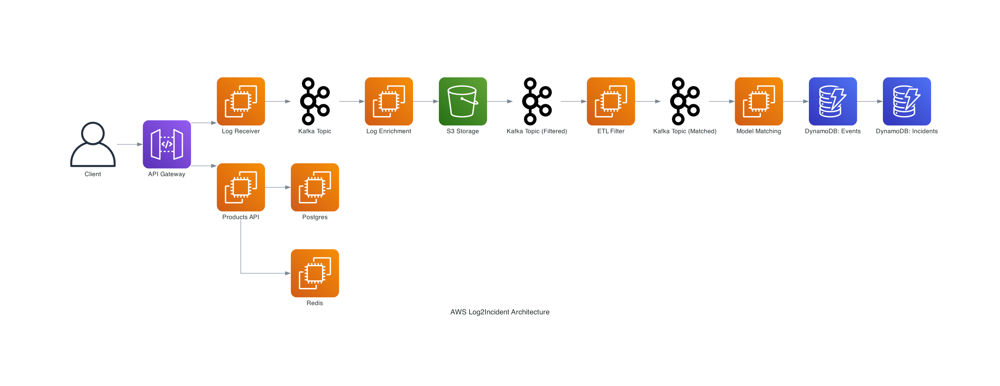
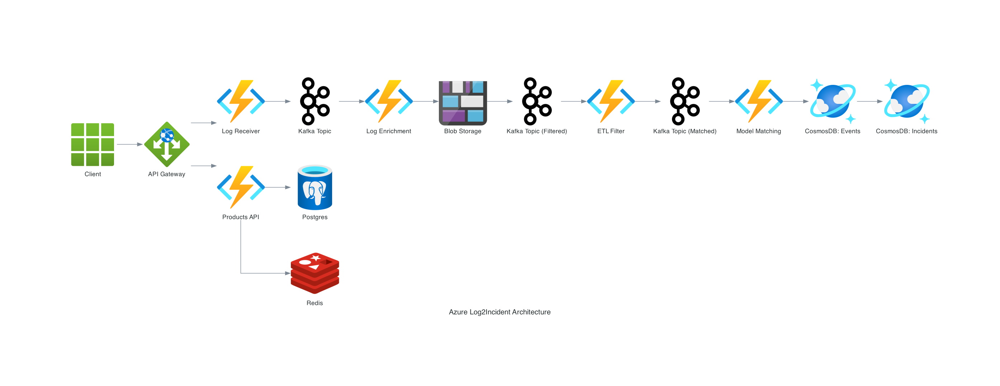

# Log2Incident

A log processing and product operations platform with a FastAPI backend, React frontend, Redis cache, and Postgres persistence.

## Overview

The platform has two tracks:
1. Log pipeline: receives logs, sends them through Kafka topics (with fan-out for log types), tags and stores them, then creates events/incidents.
2. Product control flow: uses Postgres as source-of-truth with Redis read/write-through caching for product data.

## Architecture


### AWS Architecture
#### Visual Flowchart

```mermaid
flowchart TD
  subgraph AWS
    A1[API Gateway] --> A2[Log Receiver & Enricher]
    A2 --> K1[Kafka Topic]
    K1 --> B2[S3 Storage]
    B2 --> K2[Kafka Topic (Filtered)]
    K2 --> B3[ETL Filter]
    B3 --> K3[Kafka Topic (Matched)]
    K3 --> C1[Model Matching]
    C1 --> DDB1[DynamoDB: Events]
    DDB1 --> DDB2[DynamoDB: Incidents]
    A1 -.-> D1[Products API]
    D1 --> D2[Postgres]
    D1 --> D3[Redis]
  end
  style AWS fill:#f7faff,stroke:#1e90ff,stroke-width:2px
  classDef aws fill:#f7faff,stroke:#1e90ff,stroke-width:2px;
```




### Azure Architecture
#### Visual Flowchart

```mermaid
flowchart TD
  subgraph Azure
    Z1[API Gateway] --> Z2[Log Receiver & Enricher]
    Z2 --> K1[Kafka Topic]
    K1 --> Y2[Blob Storage]
    Y2 --> K2[Kafka Topic (Filtered)]
    K2 --> Y3[ETL Filter]
    Y3 --> K3[Kafka Topic (Matched)]
    K3 --> X1[Model Matching]
    X1 --> CDB1[CosmosDB: Events]
    CDB1 --> CDB2[CosmosDB: Incidents]
    Z1 -.-> W1[Products API]
    W1 --> W2[Postgres]
    W1 --> W3[Redis]
  end
  style Azure fill:#f7faff,stroke:#007fff,stroke-width:2px
  classDef azure fill:#f7faff,stroke:#007fff,stroke-width:2px;
```



**Notes:**
- **Log Receiver & Enricher**: Receives and enriches logs (adds metadata, normalization, basic tagging).
- **ETL Filter**: Service deployed in EKS/AKS, applies filter logic to logs.
- **Model Matching**: The core logic that uses rules/models to match/enrich logs, create events, and aggregate incidents.

The system consists of two main components:

### 1. API Gateway & Log Receiver
- **API Gateway**: FastAPI-based HTTP endpoint that receives logs via REST API
- **Log Receiver**: Accepts logs and publishes them to Kafka topics. Logs are catalogued into different types, enabling fan-out to multiple Kafka topics for parallel processing (e.g., by log type, severity, or source). Downstream services can also perform fan-in by consuming from multiple topics as needed.
- **Auth**: Username validation + login with immediate username errors and accumulated wrong-password attempts
- **Products**: Product list/get/update APIs backed by Postgres + Redis
- Provides endpoints:
  - `POST /logs` - Submit a log entry
  - `GET /health` - Health check
  - `GET /auth/validate-username` - Check username exists
  - `POST /auth/login` - Login endpoint
  - `GET /products` - List products
  - `GET /products/{product_id}` - Fetch one product
  - `PATCH /products/{product_id}/price` - Update product price (syncs Redis immediately)

### 2. Processing Pipeline
1. **Ingestion**: Consume logs from Kafka topics (with fan-out/fan-in for different log types and processing needs)
2. **Tagging**: Apply model-matching to add tags to logs
3. **Storage**: Store tagged logs in S3 bucket
4. **ETL Filter**: Run a minimal Flink ETL demo (with local fallback if PyFlink is unavailable)
5. **Events**: Create events from filtered logs
6. **Incidents**: Aggregate events into incidents (accumulated or instant)

## Installation

1. Clone the repository.
2. Install dependencies: `pip install -r requirements.txt`
3. Copy environment template: `cp .env.example .env`
4. Set up AWS credentials/configuration for log pipeline pieces.

### Start Redis + Postgres

```bash
docker compose up -d
```

This starts:
- Postgres on `localhost:5432` (`postgres/postgres`, DB `log2incident`)
- Redis on `localhost:6379`

## Quick Start

Run backend, pipeline, and frontend in parallel (separate terminals):

**Terminal 1 - Start the API Gateway:**
```bash
python3 scripts/run_api_gateway.py
```
The API will be available at `http://localhost:8000`

**Terminal 2 - Start the Processing Pipeline:**
```bash
python3 scripts/run_pipeline.py
```

Optional: run the ETL demo job directly:

```bash
python3 scripts/run_flink_demo.py
```

Notes:
- If `pyflink` is installed, the demo uses PyFlink DataStream filtering.
- If `pyflink` is not installed, it automatically uses a local fallback mode so the demo still runs.

**Terminal 3 - Start the React Frontend:**
```bash
cd frontend
npm install
npm run dev
```

Frontend URL: `http://localhost:5173`

### Example: Send a Log

```bash
curl -X POST "http://localhost:8000/logs" \
  -H "Content-Type: application/json" \
  -d '{
    "source": "my-app",
    "message": "Database connection failed",
    "metadata": {
      "severity": "error",
      "component": "auth-service"
    }
  }'
```

### API Documentation

Once the API Gateway is running, visit:
- Interactive docs: `http://localhost:8000/docs`
- ReDoc: `http://localhost:8000/redoc`

### Login Behavior

- Wrong username: immediate error (`Unknown username`)
- Wrong password: error includes accumulated attempt count (`Wrong password. Attempt #N`)

Default users:
- `demo / demo123`
- `admin / admin123`

Override with `AUTH_USERS_JSON` in `.env`.

### Product Cache Sync Behavior

- Source of truth: Postgres (`products` table)
- Cache layer: Redis (`product:{id}`)
- On price update (`PATCH /products/{id}/price`):
  1. Write new price to Postgres
  2. Immediately write updated product document to Redis

## Development

- Tests: `python -m pytest tests/`
- Linting: Use your preferred linter.

### Frontend Tests

From `frontend/`:

- Unit/component tests (Vitest + React Testing Library):
  - `npm test`
- Watch mode:
  - `npm run test:watch`
- Browser frontend-to-backend E2E (Playwright):
  - `npm run test:e2e`

E2E prerequisites:
- Backend running on `http://localhost:8000`
- Frontend running on `http://localhost:5173`
- Redis and Postgres running (`docker compose up -d`)

## Deployment

Configured for local deployment. For production, deploy to AWS EMR or Kubernetes as needed.


## Infrastructure Setup with Terraform

You can provision all required cloud infrastructure using Terraform. Example steps for both AWS and Azure are below:


### AWS Setup
The Terraform configuration provisions the following AWS resources:
- VPC and subnets
- IAM roles for EKS and nodes
- S3 bucket for log storage
- EKS cluster and node group
- Kinesis stream
- **CloudWatch Log Group** for application logs
- **DynamoDB tables** for events and incidents
- **Managed Streaming for Kafka (MSK)** cluster

**Setup steps:**
1. Install [Terraform](https://www.terraform.io/downloads.html) if not already installed.
2. Configure your AWS credentials (via `aws configure` or environment variables).
3. Navigate to the AWS Terraform directory:
   ```bash
   cd deploy/infra/aws
   ```
4. Initialize Terraform (for the 1st run):
   ```bash
   terraform init
   ```
5. Plan Terraform (for the following runs):
   ```bash
   terraform plan
   ```
6. Review and customize `main.tf` as needed (see above resources).
7. Apply the Terraform plan to create resources:
   ```bash
   terraform apply
   ```
8. After completion, note the outputs (VPC ID, EKS cluster name, S3 bucket, DynamoDB, MSK, etc.).
9. Update your kubeconfig to connect to the EKS cluster (see AWS docs or Terraform output).


### Azure Setup
The Terraform configuration provisions the following Azure resources:
- Virtual network and subnet
- Managed identity
- AKS cluster
- Event Hub namespace and topic
- **Application Insights** for monitoring
- **CosmosDB account, databases, and containers** for events and incidents

**Setup steps:**
1. Install [Terraform](https://www.terraform.io/downloads.html) and [Azure CLI](https://docs.microsoft.com/en-us/cli/azure/install-azure-cli) if not already installed.
2. Log in to Azure:
   ```bash
   az login
   ```
3. Navigate to the Azure Terraform directory:
   ```bash
   cd deploy/infra/azure
   ```
4. Initialize Terraform (for the 1st run):
   ```bash
   terraform init
   ```
5. Plan Terraform (for the following runs):
   ```bash
   terraform plan
   ```
6. Review and customize `main.tf` as needed (see above resources).
7. Apply the Terraform plan to create resources:
   ```bash
   terraform apply
   ```
8. After completion, note the outputs (VNet ID, AKS cluster name, CosmosDB, Application Insights, Event Hub, etc.).
9. Update your kubeconfig to connect to the AKS cluster (see Azure docs or Terraform output).

---

## Cloud Deployment (EKS/AKS)


You can deploy the platform to AWS EKS or Azure AKS using the provided infrastructure-as-code and Kubernetes manifests. Follow these steps in order:

### 1. Provision the Cluster

- **AWS EKS:**
  - Go to `deploy/infra/aws/` and review `main.tf` (Terraform).
  - Initialize and apply Terraform to create the EKS cluster and resources:
    ```bash
    cd deploy/infra/aws
    terraform init
    terraform apply
    ```
  - Update your kubeconfig to connect to the new EKS cluster (see AWS docs or Terraform output).

- **Azure AKS:**
  - Go to `deploy/infra/azure/` and review `main.tf` (Terraform).
  - Initialize and apply Terraform to create the AKS cluster and resources:
    ```bash
    cd deploy/infra/azure
    terraform init
    terraform apply
    ```
  - Update your kubeconfig to connect to the new AKS cluster (see Azure docs or Terraform output).

### 2. Deploy Kafka to EKS/AKS

Kafka is deployed inside your Kubernetes cluster using the Strimzi operator. After your cluster is ready and `kubectl` is configured:

1. **Install the Strimzi Kafka Operator**
   - Download and apply the Strimzi installation manifests:
     ```bash
     kubectl create namespace kafka
     kubectl apply -f https://strimzi.io/install/latest?namespace=kafka -n kafka
     ```
   - Wait for the Strimzi operator pods to be running:
     ```bash
     kubectl get pods -n kafka
     ```

2. **Deploy the Kafka Cluster**
   - Apply the provided Kafka cluster manifest:
     ```bash
     kubectl apply -f deploy/infra/kafka-cluster.yaml -n kafka
     ```
   - Check that the Kafka and Zookeeper pods are running:
     ```bash
     kubectl get pods -n kafka
     ```

3. **(Optional) Expose Kafka Externally**
   - For development, you may use NodePort or LoadBalancer services. For production, configure Ingress or use an internal service as needed. See Strimzi documentation for details.

4. **Verify Kafka is Ready**
   - Ensure all Kafka and Zookeeper pods are in the `Running` state before proceeding with other platform components.

**Note:** The provided manifest deploys a basic Kafka cluster. You can customize `deploy/infra/kafka-cluster.yaml` for your scaling, storage, or security needs. See the [Strimzi documentation](https://strimzi.io/docs/) for advanced configuration.

### 3. Deploy Platform Components

Once your cluster and Kafka are ready and `kubectl` is configured:

- Apply the core manifests (monitoring, etc.):
  ```bash
  kubectl apply -f deploy/infra/eks-logging-metrics.yaml   # For AWS
  kubectl apply -f deploy/infra/azure/aks-monitoring.yaml  # For Azure
  # Add other manifests as needed
  ```

- (Optional) Use Helm charts in `deploy/helm/log2incident/` for more advanced deployments:
  ```bash
  helm install log2incident ./deploy/helm/log2incident -f deploy/helm/log2incident/values.yaml
  # Or use values-aws.yaml / values-azure.yaml for cloud-specific configs
  ```

### 4. Access the Platform

- Expose/load balance services as needed (see your cloud provider's docs or add Ingress manifests).
- Continue with the [Quick Start](#quick-start) to run backend, pipeline, and frontend.

**Note:** You may need to update secrets, storage classes, or cloud-specific settings in the manifests for your environment.